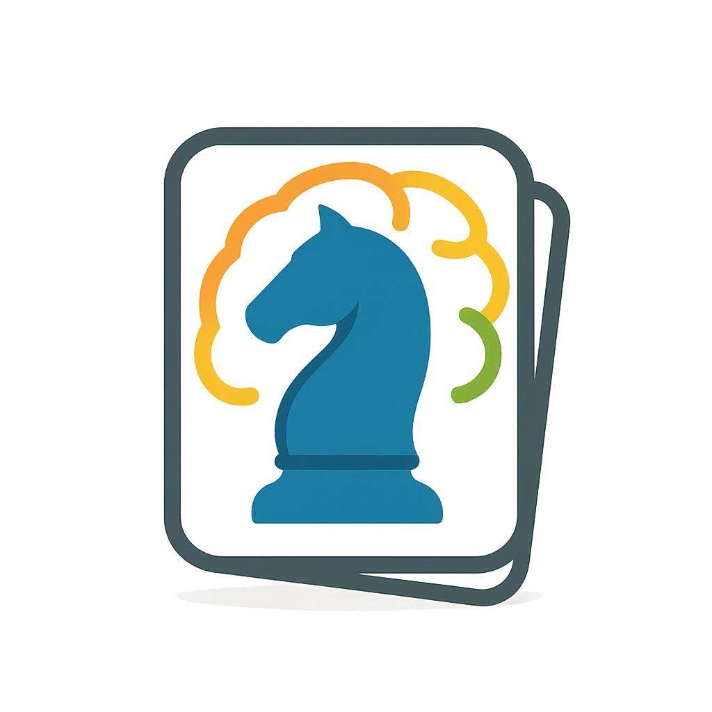
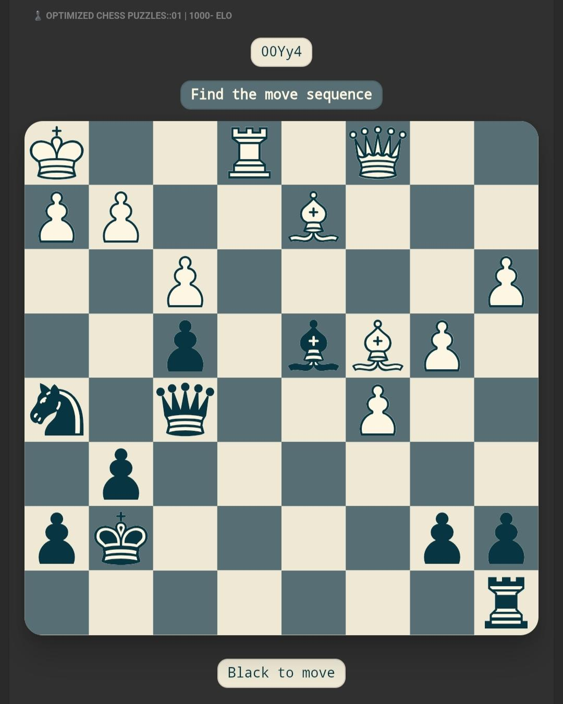
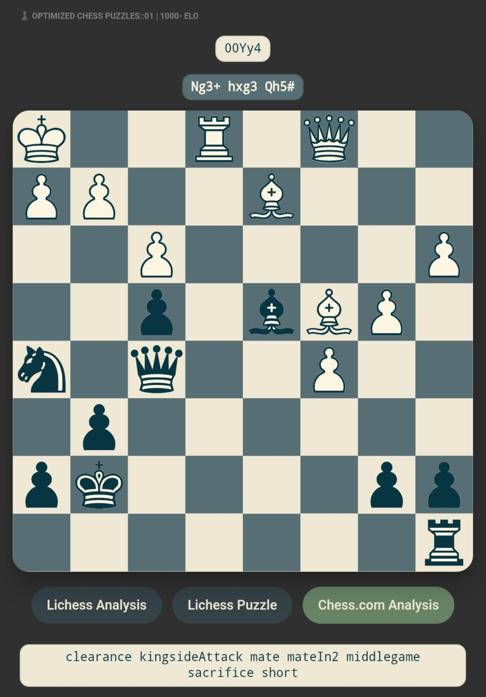
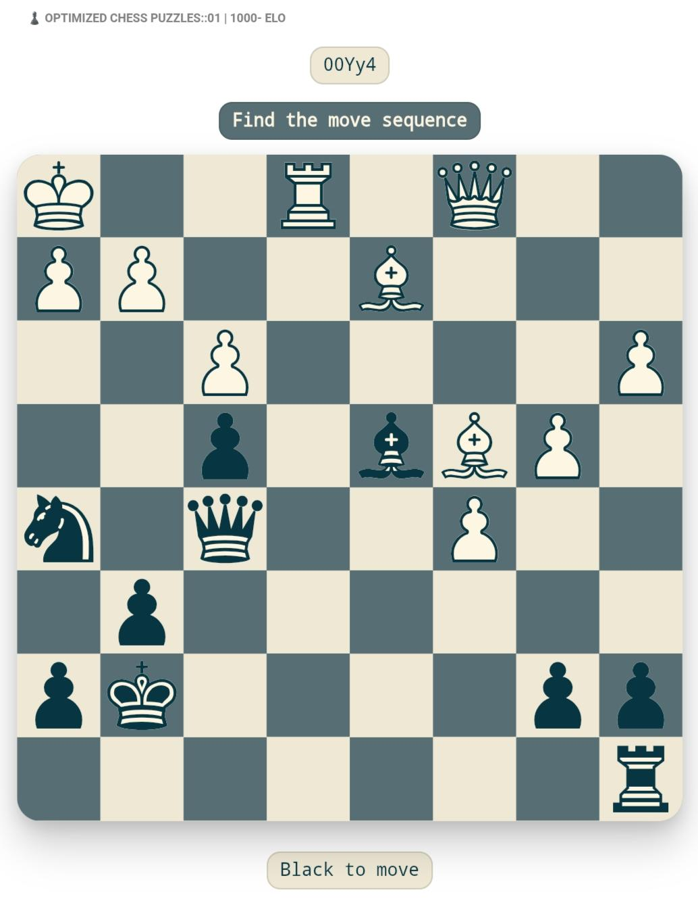
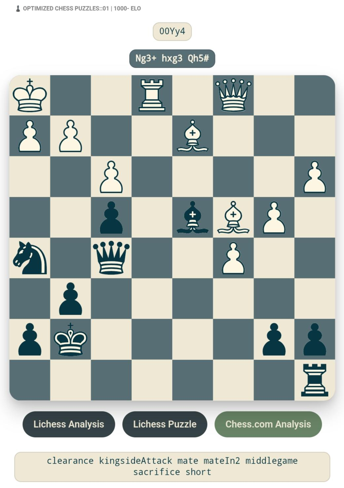
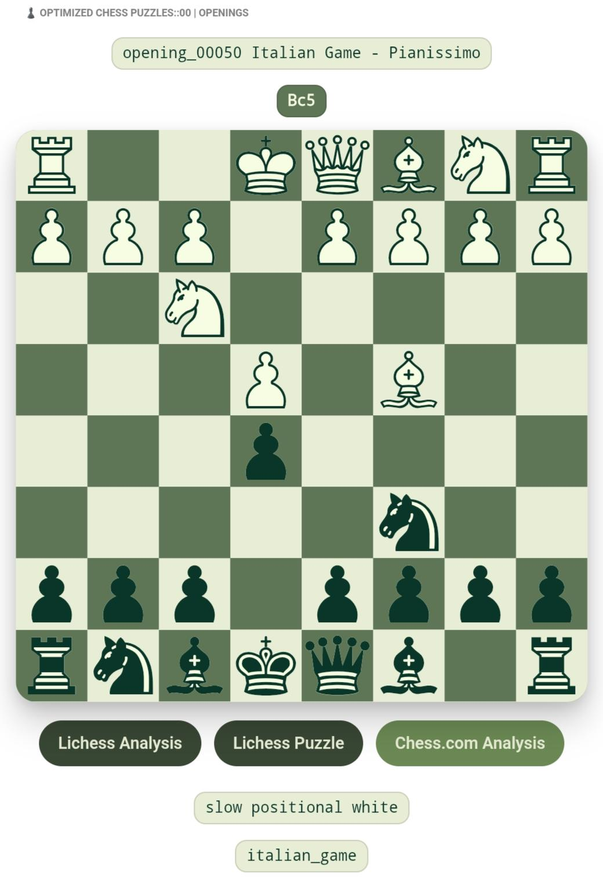
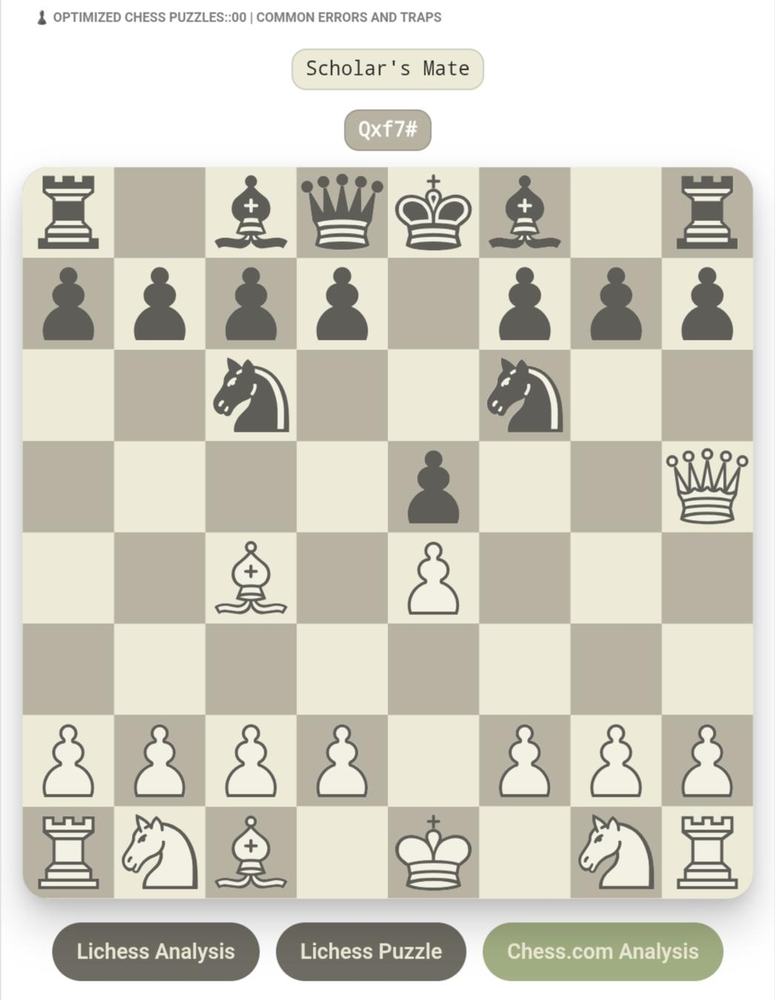

# Optimized Chess Puzzles 🎯♟️✨

[](https://opensource.org/licenses/MIT)


[](https://codecov.io/gh/SKOHscripts/Optimized-Chess-Puzzles)




**Scientifically Curated Training Deck for Chess Tactical Mastery for [Anki](https://apps.ankiweb.net/)** featuring:

- **~16 800** puzzles curated from [complete Lichess database](https://database.lichess.org/) using advanced thematic sampling algorithms
- Each ELO band targeting **~1200** puzzles (14 sub-decks)
- **Near-100%** motif coverage per ELO band (tactical themes only, metadata tags excluded)
- Pedagogical quality for systematic chess improvement.
- **500+ opening variations** across 13+ major families
- **Color-balanced training** with separate analysis for white openings and black defenses
- **Mainline vs. variant ratio** to ensure theoretical soundness

The deck is available in the following languages: **French**, **German**, **Spanish**, **Italian**, **Portuguese**, **Dutch**, **Russian**, **Chinese**, **Japanese**, **Polish**, **Turkish**, and **English**.

---

### 💖 Support This Project

This project is the result of many hours of work, passion, and coffee ☕. If you find it useful, it saves you time, or you simply appreciate the effort, your support would be a tremendous encouragement.

If you'd like to help me continue to maintain and improve this project, please consider making a donation. Every contribution, big or small, is greatly appreciated and allows me to dedicate more time to developing quality tools.

<p align="center">
  <a href="https://html-preview.github.io/?url=https://github.com/SKOHscripts/donate.github.io/blob/main/donate%2Fredirect.html" target="_blank">
    
  </a>
  <br>
  <strong>Click the icon above to donate! 🙏</strong>
</p>

Thank you from the bottom of my heart for your support! 🙏

---

#### Table of contents

- [Table of contents](#table-of-contents)
- [Features](#features)
- [🎯 About This Deck](#-about-this-deck)
- [🧠 Training Philosophy: Why Visualization Matters](#-training-philosophy-why-visualization-matters)
- [🔬 Training Methodologies](#-training-methodologies)
  - [**1. Woodpecker Method by ELO Range 🔨**](#1-woodpecker-method-by-elo-range-)
  - [**2. Personalized Spaced Repetition 🧠🔄**](#2-personalized-spaced-repetition-)
  - [**3. Targeted Thematic Training 🎨**](#3-targeted-thematic-training-)
- [🔬 Interface Design and Scientific Foundations](#-interface-design-and-scientific-foundations)
  - [**Clean Interface for Cognitive Optimization**](#clean-interface-for-cognitive-optimization)
  - [**Scientific Foundations**](#scientific-foundations)
- [🔬 Advanced Selection Method by Thematic Sampling](#-advanced-selection-method-by-thematic-sampling)
  - [**1. Data Acquisition and Preparation 📥**](#1-data-acquisition-and-preparation-)
  - [**2. Intelligent Sampling by Thematic Diversity 🎯**](#2-intelligent-sampling-by-thematic-diversity-)
  - [**3. Exhaustive Coverage Guarantee 📊**](#3-exhaustive-coverage-guarantee-)
  - [**4. Optimized Technical Preprocessing 🔄**](#4-optimized-technical-preprocessing-)
  - [**🎯 Result: Scientifically Optimal Sampling**](#-result-scientifically-optimal-sampling)
- [🏰 Chess Opening Deck Generator & Analyzer](#-chess-opening-deck-generator--analyzer)
- [🚀 Installation (the easy way)](#-installation-the-easy-way)
  - [**Step 1: Get the apkg file**](#step-1-get-the-apkg-file)
  - [**Step 2: Import with Anki**](#step-2-import-with-anki)
- [🚀 Installation (the complete way)](#-installation-the-complete-way)
  - [**Step 1: Install CrowdAnki Plugin**](#step-1-install-crowdanki-plugin)
  - [**Step 2: Download the Optimized Chess Puzzles Pack**](#step-2-download-the-optimized-chess-puzzles-pack)
  - [**Step 3: Import with CrowdAnki**](#step-3-import-with-crowdanki)
  - [**Step 4: Update an Existing Deck (Optional)**](#step-4-update-an-existing-deck-optional)
  - [**🎯 Ready to Train!**](#-ready-to-train)
- [📱 Mobile & Cross-Platform Support](#-mobile--cross-platform-support)
- [🎁 Usage & Training Tips](#-usage--training-tips)
  - [**Personal Error Collection 📝**](#personal-error-collection-)
  - [**Thematic Training 🎨**](#thematic-training-)
- [🏆 Transform Your Chess Vision](#-transform-your-chess-vision)
  - [📊 Statistics](#-statistics)

## Features

<table>
  <tr><th scope="col" colspan="2">Solarized theme, dark interface</th></tr>
  <tr><th scope="col">Front</th><th scope="col">Back</th></tr>
  <tr>
    <td></td>
    <td></td>
  </tr>
</table>

<table>
  <tr><th scope="col" colspan="2">Solarized theme, light interface</th></tr>
  <tr><th scope="col">Front</th><th scope="col">Back</th></tr>
  <tr>
    <td></td>
    <td></td>
  </tr>
</table>

<table>
  <tr><th scope="col" colspan="2">Green and Paper-sand themes</th></tr>
  <tr><th scope="col">Front</th><th scope="col">Front</th></tr>
  <tr>
    <td></td>
    <td></td>
  </tr>
</table>

***

## 🎯 About This Deck

This tactical deck has been designed as a **versatile and scientifically optimized training tool** that adapts to several chess learning approaches. Unlike traditional puzzle platforms that focus on immediate gratification, this deck emphasizes **deep learning through visualization** and **pattern recognition mastery**.

***

## 🧠 Training Philosophy: Why Visualization Matters

The only way to use puzzles and transpose them into real games is to learn to calculate, visualize the move tree, and quickly recognize attack and defense patterns. Doing puzzles on platforms, whatever they are, brings very little except immediate dopamine. It's pleasant to move pieces and see a green light indicating you found the expected solution, but **you don't absorb the positions, you don't really learn to visualize**.

**What I offer here is radical**, in the sense that it attacks the root of the problems: **visualization**. No coordinates, no piece movement, no indication arrows—only the board and your brain. Here you will need to think, learn to read coordinates, anticipate, all in a modern and clean interface. It will be difficult at first, both because of the coordinates and the moves to visualize, but you will quickly see improvements by doing ~20 new puzzles per day. And by doing I mean really try to visualize and find moves (e.g. "OK, in this position, I think next best moves are Nf7 Rh7+ Kxh7").

***

## 🔬 Training Methodologies

### **1. Woodpecker Method by ELO Range 🔨**
Each range (~1200 puzzles, 14 sub-decks: <1000, 1000–1100, …, 1700–1800, 1800–1900, 1900–2000, 2000–2200, 2200+) allows you to apply the famous Woodpecker method: solve the same set multiple times in accelerated cycles to develop automatic recognition of tactical patterns. This approach transforms conscious thinking into unconscious reflexes, drastically increasing calculation speed in games. [[1](https://forwardchess.com/blog/what-is-the-woodpecker-method/)]

### **2. Personalized Spaced Repetition 🧠🔄**
Use Anki's spaced repetition system to optimize learning according to your current level. The carefully selected puzzles guarantee constant progress without excessive frustration. Research shows that spaced repetition improves long-term retention by **200-300%** compared to traditional methods. [[2](https://www.bananote.ai/blog/the-complete-spaced-repetition-schedule-for-long-term-retention-a-science-based-guide-to-never-forgetting-what-you-learn)], [[3](https://pmc.ncbi.nlm.nih.gov/articles/PMC12357012/)]

> #### Recommended Tool: Anki 📱💻
> I strongly recommend using **Anki** for learning these puzzles, as it's specifically designed for spaced repetition and offers optimal scheduling algorithms, especially with the FSRS scheduling algorithm.
>
> **Available on multiple platforms:**
> - **Desktop**: [https://apps.ankiweb.net/](https://apps.ankiweb.net/)
> - **Mobile**: iOS App Store, Google Play Store, F-Droid
> - **Web**: [https://ankiweb.net/](https://ankiweb.net/) for synchronization

### **3. Targeted Thematic Training 🎨**
Thanks to detailed tags (themes and openings), you can create custom decks to work specifically on your weaknesses: forks, pins, discovered attacks, or specific defenses like the Sicilian or French. This targeted approach accelerates learning of specific patterns. Some specific filtered decks are ready to use for the example.

***

## 🔬 Interface Design and Scientific Foundations

### **Clean Interface for Cognitive Optimization**

**Minimalist Front Display 🎨**
The interface shows only the essentials: the board and the side to move. This deliberate simplification eliminates visual distractions and forces concentration on pure analysis. Research in cognitive psychology shows that a simplified visual environment improves problem-solving performance. [[4](https://pmc.ncbi.nlm.nih.gov/articles/PMC7077814/)], [[5](https://www.sciencedirect.com/science/article/pii/S0959475224001282)]
It uses the useful [HTMLTTCHESS](https://github.com/xeyownt/htmlttchess) a javascript program that facilitates rendering of chessboards in HTML without the need of extra images.

**No Piece Movement: A Founded Pedagogical Choice 🚫**
The inability to move pieces forces development of "chess vision"—this crucial ability to visualize moves in your head. Studies show that strong players possess visualization capabilities **3-4 times superior** to average players.

**Progressive Disclosure 📊**
Solution, themes, and analysis links appear only after your attempt, respecting optimal learning principles and the "progressive disclosure" methodology.

### **Scientific Foundations**

- **Pattern Recognition & Cognitive Chunks 🧩**: Based on Chase & Simon's (1973) "chunking" theory
- **Cognitive Load Theory 🧠⚖️**: Interface follows Sweller's principles to maximize mental resources
- **Skill Transfer 🔄**: Visualization training shows **35-50% transfer rate** to actual game performance [[6](https://aassjournal.com/article-1-1540-en.pdf)], [[7](http://www.diva-portal.org/smash/get/diva2:1971308/FULLTEXT01.pdf)], [[8](https://www.frontiersin.org/journals/psychology/articles/10.3389/fpsyg.2019.02407/full)]

***

## 🔬 Advanced Selection Method by Thematic Sampling

### **1. Data Acquisition and Preparation 📥**
The script downloads the **complete Lichess database** (several million puzzles) and automatically processes it. This database contains all community-validated puzzles with their metadata: ELO rating, popularity, tactical themes, and associated openings.

### **2. Intelligent Sampling by Thematic Diversity 🎯**
**Fundamental principle:** Instead of simply taking the most popular puzzles (which would create redundancies), the script applies a **maximum-coverage algorithm** with a Bayesian quality score and explicit motif caps:

```python
def sample_by_themes(tranche, target_per_theme=17, popularity_threshold=90,
                     target_deck_size=1200, min_nbplays=20):
```

**Selection steps:**
1. **Quality scoring**: Each puzzle gets a Bayesian confidence score combining Popularity and NbPlays — a 100%/3-plays puzzle correctly ranks below a 92%/5000-plays puzzle.
2. **Motif filtering**: A denylist removes non-tactical metadata tags (`mateIn1..5`, `oneMove`, `short/long`, `crushing`, `master`…) so the diversity objective targets real patterns.
3. **Vectorized fast-pass**: For each meaningful motif, select the top `target_per_theme` puzzles by quality from the primary pool (Popularity ≥ 90%, NbPlays ≥ 20).
4. **Theme-aware complement**: Any motif still uncovered (e.g., only found in low-popularity puzzles) gets a best-available puzzle added without a popularity gate.
5. **Quality top-up**: Fill to `target_deck_size` in quality order, respecting a **true per-motif cap** that counts co-occurrences across all motifs of each selected puzzle.

### **3. Exhaustive Coverage Guarantee 📊**
If thematic sampling produces fewer than 700 puzzles (only for tiny tranches), the script fills up with the highest-quality remaining puzzles. In normal operation, the theme-aware complement step guarantees ≥ 1 puzzle per tactical motif present in the tranche.

### **4. Optimized Technical Preprocessing 🔄**
**Crucial point**: Lichess puzzles show the position **before** the opponent's move. The script automatically applies this first move to present the real position to solve, then converts remaining moves to readable notation (SAN).

### **🎯 Result: Scientifically Optimal Sampling**
This method produces decks that:
- **Maximize pattern diversity** (>98% thematic coverage)
- **Prioritize pedagogical quality** (community-validated puzzles)
- **Avoid redundancies** while guaranteeing learning through repetition
- **Adapt to level** (increasing complexity by ELO ranges)

## 🏰 Chess Opening Deck Generator & Analyzer

Let’s introduce the **Chess Opening Deck Generator & Analyzer** - the perfect companion to tactical puzzle decks! This powerful new module allows you to **create, analyze, and optimize your personalized opening repertoire** directly with your json repertoire.

### 📊 In-Depth Opening Analysis

The analyzer generates **professional-quality reports** that show you exactly where your opening knowledge stands. Here's a sample of what you'll see:
[Opening Report made with the opening json file](opening_report.txt)

### 🔍 Key Features That Set Us Apart

#### 🌐 Comprehensive Opening Coverage
- **500+ opening variations** across 15+ major families
- **Color-balanced training** with separate analysis for white openings and black defenses
- **Mainline vs. variant ratio** to ensure theoretical soundness

#### 📈 Advanced Metrics & Visualization
- **Star-based coverage evaluation** for each opening family
- **Interactive ASCII board previews** of critical positions
- **Balance meters** showing white/black distribution at a glance
- **Depth distribution analysis** to identify superficial coverage

#### 💡 Personalized Learning Path
- **Targeted recommendations** based on your specific gaps
- **Progression goals** tailored to your current level
- **Critical position identification** for focused study
- **Thematic analysis** to strengthen specific aspects of your repertoire

### 🚀 Getting Started with Opening Decks

Creating your personalized opening deck is incredibly simple:

1. **Prepare your opening repertoire** in JSON format (use our comprehensive template)
2. **Run the generator** with just 3 lines of code:
```python
generator = OpeningDeckGenerator()
generator.add_from_popular_openings(your_openings_data)
generator.generate_csv('my_openings.csv')
```

**Ready to master your openings?** The same scientific principles that power the tactical deck now extend to opening preparation! Combine both for **complete chess mastery** from move 1 to checkmate. 🏆♟️


***
## 🚀 Installation (1st method using apkg)

### **Step 1: Get the apkg file**

1. **Visit the shared deck**: [https://ankiweb.net/shared/info/894523279](https://ankiweb.net/shared/info/894523279)
2. **Download** the apkg file

### **Step 2: Import with Anki**

1. Go to **File** → **Import**
2. **Select the apkg file**
3. Choose **"Update existing deck"** when prompted and choose whether you want to import schedules
4. You are ready! ✅

## 🚀 Installation (2nd method using CrowdAnki)

### **Step 1: Install CrowdAnki Plugin**

1. **Open Anki** and go to **Tools** → **Add-ons**
2. Click **Get Add-ons...** and enter this code: `1788670778` [CrowdAnki](https://ankiweb.net/shared/info/1788670778)
3. Click **OK** and restart Anki
4. The CrowdAnki plugin is now installed! 🎉

### **Step 2: Download the Optimized Chess Puzzles Pack**

1. **Visit the repository**: [https://github.com/SKOHscripts/Optimized-Chess-Puzzles](https://github.com/SKOHscripts/Optimized-Chess-Puzzles)
2. In the [Releases section](https://github.com/SKOHscripts/Optimized-Chess-Puzzles/releases), download the ZIP archive corresponding to the version of the deck you want to use.
3. **Extract** the ZIP file to your computer
4. Locate the **deck folder** containing the JSON file and media folder

### **Step 3: Import with CrowdAnki**

1. **Open Anki** and go to **File** → **CrowdAnki: Import from disk**
2. **Browse** to the extracted deck folder (containing the `.json` file)
3. **Select the folder** and click **OK**
4. CrowdAnki will import the deck with all media files 📚

### **Step 4: Update an Existing Deck (Optional)**

If you already have the deck and want to update it:

1. Go to **File** → **CrowdAnki: Import from disk**
2. **Select the updated deck folder**
3. Choose **"Update existing deck"** when prompted
4. Your progress will be preserved while new cards are added! ✅

### **🎯 Ready to Train!**

The deck is now available in your Anki collection, organized by ELO ranges with optimized spaced repetition intervals. Each card includes:
- **FEN Position**: Real position to analyze (after preprocessing)
- **Moves_SAN**: Move sequence in readable notation
- **Tactical themes** and **opening tags** to display
- **Unified Tags**: Merged themes + openings for easy filtering
- **Direct links** to Lichess and Chess.com for deeper analysis
- **Metadata**: Rating, popularity for progress tracking
- **Confidence**: The Bayesian quality score computed at selection time (Popularity + NbPlays, confidence-weighted), shown on the back as a ★ pill so you can gauge how community-validated each puzzle is
- **Diplay theme** used for the card (available themes are *theme-solarized*, *theme-paper-sand* and nothing for default theme)

Every sub-deck also carries a **rich description** generated from the selection statistics: puzzle count, ELO range/average, average popularity, motif/theme coverage, a full theme-frequency breakdown, and a Woodpecker-based estimate of how long it takes to master the band (at ~20 new puzzles/day).

This project thus transforms a raw database of millions of puzzles into **custom training sets**, optimized for systematic progression and lasting memorization of tactical patterns essential at each level! 🚀♟️

***

## 📱 Mobile & Cross-Platform Support

This deck is designed to work across all platforms supported by Anki.

### **Android**
The **[AnkiDroid](https://github.com/ankidroid/Anki-Android)** app is free, open-source, and excellent. Simply sync your AnkiWeb account to access it. If you find AnkiDroid useful, consider supporting its development team via [OpenCollective](https://opencollective.com/ankidroid).

### **iOS / iPhone & iPad**
[](README_iOS.md)

The **AnkiMobile** app on the App Store is paid ($29.99). If you wish to use this deck **for free** on iPhone or iPad, we've written a **comprehensive, detailed guide** explaining how to use **AnkiWeb via Safari**.

**Click the badge above** for complete instructions, advantages/limitations, and the step-by-step sync procedure.

**Supporting Anki:** Remember that purchasing [AnkiMobile](https://apps.apple.com/us/app/ankimobile-flashcards/id373493387) directly funds the ongoing development of Anki itself, which benefits all users across all platforms.

***

## 🎁 Usage & Training Tips

### **Personal Error Collection 📝**
The deck includes a special section for errors and traps encountered in your games. After analyzing your games:

1. **Identify critical positions** where you made mistakes
2. **Click "Share FEN position"** on your analysis platform
3. **Create a new card** with the position and correct moves
4. **Add context** and use specific tags for easy review

### **Thematic Training 🎨**
Use Anki's filtering system to focus on specific weaknesses:
- Filter by **tactical themes** (fork, pin, skewer, etc.)
- Filter by **opening systems** (Sicilian, French, etc.)
- Create **custom study sessions** based on your needs

***

## 🏆 Transform Your Chess Vision

This deck combines the best modern pedagogical practices:
- ✅ **Spaced repetition** for memory anchoring
- ✅ **Forced visualization** to develop intuition
- ✅ **Thematic diversity** for generalization
- ✅ **Cognitively optimized interface** for concentration

**Start your journey to tactical mastery today! I hope you improve, that this deck is useful to you, and that you enjoy playing it.** 🚀♟️

***

### 📊 Statistics
- **Based on**: Lichess community database
- **Optimization**: Spaced repetition algorithms
- **Coverage**: Near-100% motif coverage per ELO band (tactical themes, denylist applied)
- **Quality**: Bayesian quality score combining Popularity + NbPlays (confidence-weighted)
- **Volume**: ~1200 puzzles per ELO band (14 sub-decks, bounded high-ELO ranges)

***

**License**: MIT | **Contributing**: Pull requests welcome | **Issues**: [Report here](https://github.com/SKOHscripts/Optimized-Chess-Puzzles/issues)
