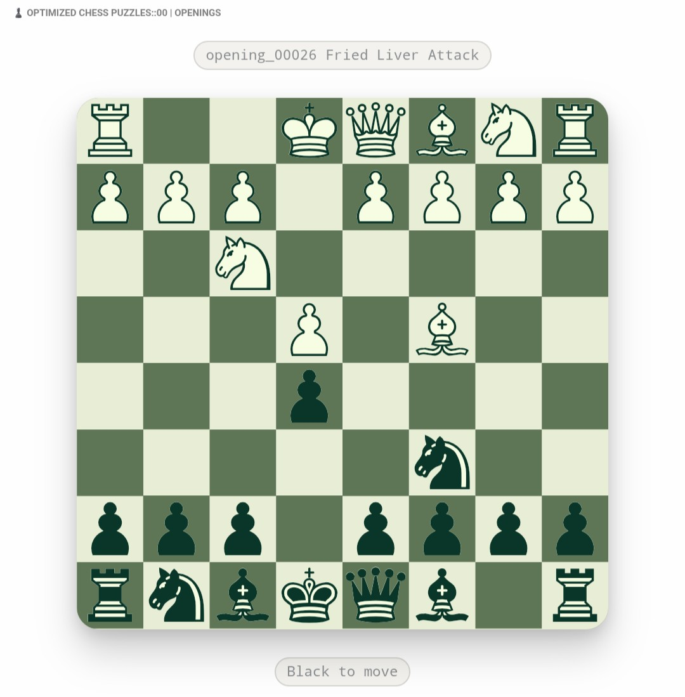

# Optimized Chess Puzzles 🎯♟️✨

[](https://opensource.org/licenses/MIT)


[](https://codecov.io/gh/SKOHscripts/Optimized-Chess-Puzzles)

  

**Scientifically Curated Training Deck for Chess Tactical Mastery for [Anki](https://apps.ankiweb.net/)** featuring:

- **12674** puzzles curated from [complete Lichess database](https://database.lichess.org/) using advanced thematic sampling algorithms
- Each 100 ELO range containing **~1200** puzzles
- **≥98.4%** coverage over all themes available in each 100 ELO range
- Pedagogical quality for systematic chess improvement.

The deck is available in the following languages: **French**, **German**, **Spanish**, **Italian**, **Portuguese**, **Dutch**, **Russian**, **Chinese**, **Japanese**, **Polish**, **Turkish**, and **English**.

---

#### Table of contents *generated with [DocToc](https://github.com/thlorenz/doctoc)*

- [Features](#features)
- [🎯 About This Deck](#-about-this-deck)
- [🧠 Training Philosophy: Why Visualization Matters](#-training-philosophy-why-visualization-matters)
- [🔬 Training Methodologies](#-training-methodologies)
  - [**1. Woodpecker Method by ELO Range 🔨**](#1-woodpecker-method-by-elo-range-)
  - [**2. Personalized Spaced Repetition 🧠🔄**](#2-personalized-spaced-repetition-)
  - [**3. Targeted Thematic Training 🎨**](#3-targeted-thematic-training-)
- [🖥️ Interface Design and Scientific Foundations](#-interface-design-and-scientific-foundations)
  - [**Clean Interface for Cognitive Optimization**](#clean-interface-for-cognitive-optimization)
  - [**Scientific Foundations**](#scientific-foundations)
- [🔬 Advanced Selection Method by Thematic Sampling](#-advanced-selection-method-by-thematic-sampling)
  - [**1. Data Acquisition and Preparation 📥**](#1-data-acquisition-and-preparation-)
  - [**2. Intelligent Sampling by Thematic Diversity 🎯**](#2-intelligent-sampling-by-thematic-diversity-)
  - [**3. Exhaustive Coverage Guarantee 📊**](#3-exhaustive-coverage-guarantee-)
  - [**4. Optimized Technical Preprocessing ⚙️**](#4-optimized-technical-preprocessing-)
  - [**🎯 Result: Scientifically Optimal Sampling**](#-result-scientifically-optimal-sampling)
- [🚀 Installation](#-installation)
  - [**Step 1: Install CrowdAnki Plugin**](#step-1-install-crowdanki-plugin)
  - [**Step 2: Download the Optimized Chess Puzzles Pack**](#step-2-download-the-optimized-chess-puzzles-pack)
  - [**Step 3: Import with CrowdAnki**](#step-3-import-with-crowdanki)
  - [**Step 4: Update an Existing Deck (Optional)**](#step-4-update-an-existing-deck-optional)
  - [**🎯 Ready to Train!**](#-ready-to-train)
- [🎁 Usage & Training Tips](#-usage--training-tips)
  - [**Personal Error Collection 📝**](#personal-error-collection-)
  - [**Thematic Training 🎨**](#thematic-training-)
- [🏆 Transform Your Chess Vision](#-transform-your-chess-vision)
  - [📊 Statistics](#-statistics)
  - [🎯 **Multiple Pack Uses**](#-multiple-pack-uses)
  - [🖥️ **Clean Interface for Cognitive Optimization**](#-clean-interface-for-cognitive-optimization)
  - [🚫 **No Piece Movement: A Founded Pedagogical Choice**](#-no-piece-movement-a-founded-pedagogical-choice)
  - [🔬 **Scientific Bases of Design Choices**](#-scientific-bases-of-design-choices)
  - [🏆 **Result: A Scientifically Optimized Training Tool**](#-result-a-scientifically-optimized-training-tool)
- [🔬 **Advanced Selection Method by Thematic Sampling**](#-advanced-selection-method-by-thematic-sampling)
  - [**1. Data Acquisition and Preparation 📥**](#1-data-acquisition-and-preparation--1)
  - [**2. Intelligent Sampling by Thematic Diversity 🎯**](#2-intelligent-sampling-by-thematic-diversity--1)
  - [**3. Exhaustive Coverage Guarantee 📊**](#3-exhaustive-coverage-guarantee--1)
  - [**4. Optimized Technical Preprocessing ⚙️**](#4-optimized-technical-preprocessing--1)
  - [**5. Quality Control and Transparency 📈**](#5-quality-control-and-transparency-)
  - [**6. Data Structure Optimized for Anki 📋**](#6-data-structure-optimized-for-anki-)
  - [**🎯 Result: Scientifically Optimal Sampling**](#-result-scientifically-optimal-sampling-1)


## Features

<table>
  <tr><th scope="col" colspan="2">Solarized theme, dark interface</th></tr>
  <tr><th scope="col">Front</th><th scope="col">Back</th></tr>
  <tr>
    <td></td>
    <td></td>
  </tr>
</table>

<table>
  <tr><th scope="col" colspan="2">Solarized theme, light interface</th></tr>
  <tr><th scope="col">Front</th><th scope="col">Back</th></tr>
  <tr>
    <td></td>
    <td></td>
  </tr>
</table>

<table>
  <tr><th scope="col" colspan="2">Green theme, light interface</th></tr>
  <tr><th scope="col">Front</th><th scope="col">Front</th></tr>
  <tr>
    <td></td>
    <td></td>
  </tr>
</table>

***

## 🎯 About This Deck

This tactical deck has been designed as a **versatile and scientifically optimized training tool** that adapts to several chess learning approaches. Unlike traditional puzzle platforms that focus on immediate gratification, this deck emphasizes **deep learning through visualization** and **pattern recognition mastery**.

***

## 🧠 Training Philosophy: Why Visualization Matters

The only way to use puzzles and transpose them into real games is to learn to calculate, visualize the move tree, and quickly recognize attack and defense patterns. Doing puzzles on platforms, whatever they are, brings very little except immediate dopamine. It's pleasant to move pieces and see a green light indicating you found the expected solution, but **you don't absorb the positions, you don't really learn to visualize**.

**What we offer here is radical**, in the sense that it attacks the root of the problems: **visualization**. No coordinates, no piece movement, no indication arrows—only the board and your brain. Here you will need to think, learn to read coordinates, anticipate, all in a modern and clean interface. It will be difficult at first, both because of the coordinates and the moves to visualize, but you will quickly see improvements by doing ~20 new puzzles per day.

***

## 🔬 Training Methodologies

### **1. Woodpecker Method by ELO Range 🔨**
Each range (~1200 puzzles) allows you to apply the famous Woodpecker method: solve the same set multiple times in accelerated cycles to develop automatic recognition of tactical patterns. This approach transforms conscious thinking into unconscious reflexes, drastically increasing calculation speed in games.

### **2. Personalized Spaced Repetition 🧠🔄**
Use Anki's spaced repetition system to optimize learning according to your current level. The carefully selected puzzles guarantee constant progress without excessive frustration. Research shows that spaced repetition improves long-term retention by **200-300%** compared to traditional methods. [[1](https://www.bananote.ai/blog/the-complete-spaced-repetition-schedule-for-long-term-retention-a-science-based-guide-to-never-forgetting-what-you-learn)], [[2](https://pmc.ncbi.nlm.nih.gov/articles/PMC12357012/)]

> #### Recommended Tool: Anki 📱💻
> I strongly recommend using **Anki** for learning these puzzles, as it's specifically designed for spaced repetition and offers optimal scheduling algorithms, especially with the FSRS scheduling algorithm.
>
> **Available on multiple platforms:**
> - **Desktop**: [https://apps.ankiweb.net/](https://apps.ankiweb.net/)
> - **Mobile**: iOS App Store, Google Play Store, F-Droid
> - **Web**: [https://ankiweb.net/](https://ankiweb.net/) for synchronization

### **3. Targeted Thematic Training 🎨**
Thanks to detailed tags (themes and openings), you can create custom decks to work specifically on your weaknesses: forks, pins, discovered attacks, or specific defenses like the Sicilian or French. This targeted approach accelerates learning of specific patterns.

***

## 🖥️ Interface Design and Scientific Foundations

### **Clean Interface for Cognitive Optimization**

**Minimalist Front Display 🎨**
The interface shows only the essentials: the board and the side to move. This deliberate simplification eliminates visual distractions and forces concentration on pure analysis. Research in cognitive psychology shows that a simplified visual environment improves problem-solving performance. [[3](https://pmc.ncbi.nlm.nih.gov/articles/PMC7077814/)], [[4](https://www.sciencedirect.com/science/article/pii/S0959475224001282)]
It uses the useful [HTMLTTCHESS](https://github.com/xeyownt/htmlttchess) a javascript program that facilitates rendering of chessboards in HTML without the need of extra images.

**No Piece Movement: A Founded Pedagogical Choice 🚫**
The inability to move pieces forces development of "chess vision"—this crucial ability to visualize moves in your head. Studies show that strong players possess visualization capabilities **3-4 times superior** to average players.

**Progressive Disclosure 📊**
Solution, themes, and analysis links appear only after your attempt, respecting optimal learning principles and the "progressive disclosure" methodology.

### **Scientific Foundations**

- **Pattern Recognition & Cognitive Chunks 🧩**: Based on Chase & Simon's (1973) "chunking" theory
- **Cognitive Load Theory 🧠⚖️**: Interface follows Sweller's principles to maximize mental resources
- **Skill Transfer 🔄**: Visualization training shows **35-50% transfer rate** to actual game performance [[5](https://aassjournal.com/article-1-1540-en.pdf)], [[6](http://www.diva-portal.org/smash/get/diva2:1971308/FULLTEXT01.pdf)], [[7](https://www.frontiersin.org/journals/psychology/articles/10.3389/fpsyg.2019.02407/full)]

***

## 🔬 Advanced Selection Method by Thematic Sampling

### **1. Data Acquisition and Preparation 📥**
The script downloads the **complete Lichess database** (several million puzzles) and automatically processes it. This database contains all community-validated puzzles with their metadata: ELO rating, popularity, tactical themes, and associated openings.

### **2. Intelligent Sampling by Thematic Diversity 🎯**
**Fundamental principle:** Instead of simply taking the most popular puzzles (which would create redundancies), the script applies a **maximum coverage algorithm by theme**:

```python
def sample_by_themes(tranche, target_per_theme=20, popularity_threshold=90):
```

**Selection steps:**
1. **Theme identification**: Extract all tactical themes (fork, pin, discovered attack, etc.)
2. **Quality filtering**: Priority selection of puzzles with Popularity ≥ 90%
3. **Balanced distribution**: Maximum 20 puzzles per theme to avoid overrepresentation
4. **Intelligent complement**: Add puzzles with lower popularity for rare themes

### **3. Exhaustive Coverage Guarantee 📊**
If thematic sampling produces fewer than 700 puzzles, the script automatically completes with the most popular remaining puzzles, guaranteeing sufficient volume for intensive training while preserving diversity.

### **4. Optimized Technical Preprocessing ⚙️**
**Crucial point**: Lichess puzzles show the position **before** the opponent's move. The script automatically applies this first move to present the real position to solve, then converts remaining moves to readable notation (SAN).

### **🎯 Result: Scientifically Optimal Sampling**
This method produces decks that:
- **Maximize pattern diversity** (>98% thematic coverage)
- **Prioritize pedagogical quality** (community-validated puzzles)
- **Avoid redundancies** while guaranteeing learning through repetition
- **Adapt to level** (increasing complexity by ELO ranges)

***

## 🚀 Installation

### **Step 1: Install CrowdAnki Plugin**

1. **Open Anki** and go to **Tools** → **Add-ons**
2. Click **Get Add-ons...** and enter this code: `1788670778` [CrowdAnki](https://ankiweb.net/shared/info/1788670778)
3. Click **OK** and restart Anki
4. The CrowdAnki plugin is now installed! 🎉

### **Step 2: Download the Optimized Chess Puzzles Pack**

1. **Visit the repository**: [https://github.com/SKOHscripts/Optimized-Chess-Puzzles](https://github.com/SKOHscripts/Optimized-Chess-Puzzles)
2. In the [Releases section](https://github.com/SKOHscripts/Optimized-Chess-Puzzles/releases), download the ZIP archive corresponding to the version of the deck you want to use.
3. **Extract** the ZIP file to your computer
4. Locate the **deck folder** containing the JSON file and media folder

### **Step 3: Import with CrowdAnki**

1. **Open Anki** and go to **File** → **CrowdAnki: Import from disk**
2. **Browse** to the extracted deck folder (containing the `.json` file)
3. **Select the folder** and click **OK**
4. CrowdAnki will import the deck with all media files 📚

### **Step 4: Update an Existing Deck (Optional)**

If you already have the deck and want to update it:

1. Go to **File** → **CrowdAnki: Import from disk**
2. **Select the updated deck folder**
3. Choose **"Update existing deck"** when prompted
4. Your progress will be preserved while new cards are added! ✅

### **🎯 Ready to Train!**

The deck is now available in your Anki collection, organized by ELO ranges with optimized spaced repetition intervals. Each card includes:
- **FEN Position**: Real position to analyze (after preprocessing)
- **Moves_SAN**: Move sequence in readable notation
- **Tactical themes** and **opening tags** to display
- **Unified Tags**: Merged themes + openings for easy filtering
- **Direct links** to Lichess and Chess.com for deeper analysis
- **Metadata**: Rating, popularity for progress tracking
- **Diplay theme** used for the card (available themes are *theme-solarized*, *theme-paper-sand* and nothing for default theme)

This project thus transforms a raw database of millions of puzzles into **custom training sets**, optimized for systematic progression and lasting memorization of tactical patterns essential at each level! 🚀♟️

***

## 🎁 Usage & Training Tips

### **Personal Error Collection 📝**
The deck includes a special section for errors and traps encountered in your games. After analyzing your games:

1. **Identify critical positions** where you made mistakes
2. **Click "Share FEN position"** on your analysis platform
3. **Create a new card** with the position and correct moves
4. **Add context** and use specific tags for easy review

### **Thematic Training 🎨**
Use Anki's filtering system to focus on specific weaknesses:
- Filter by **tactical themes** (fork, pin, skewer, etc.)
- Filter by **opening systems** (Sicilian, French, etc.)
- Create **custom study sessions** based on your needs

***

## 🏆 Transform Your Chess Vision

This pack combines the best modern pedagogical practices:
- ✅ **Spaced repetition** for memory anchoring
- ✅ **Forced visualization** to develop intuition
- ✅ **Thematic diversity** for generalization
- ✅ **Cognitively optimized interface** for concentration

**Start your journey to tactical mastery today!** 🚀♟️

***

### 📊 Statistics
- **Based on**: Lichess community database
- **Optimization**: Spaced repetition algorithms
- **Coverage**: >98% thematic coverage per ELO range
- **Quality**: 90%+ community approval rating
- **Volume**: ~1200 puzzles per ELO range

***

**License**: MIT | **Contributing**: Pull requests welcome | **Issues**: [Report here](https://github.com/SKOHscripts/Optimized-Chess-Puzzles/issues)
